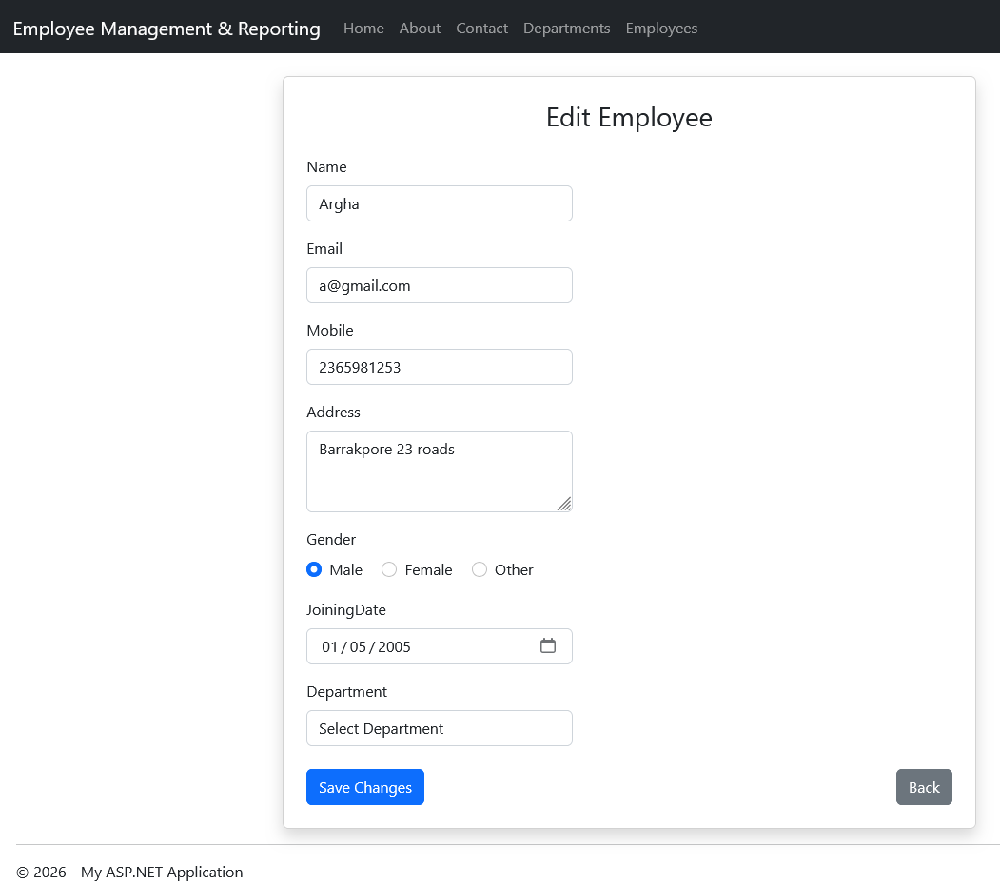
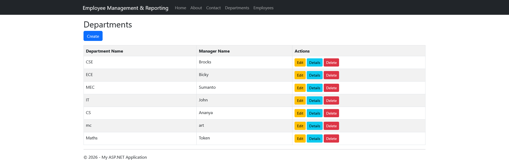
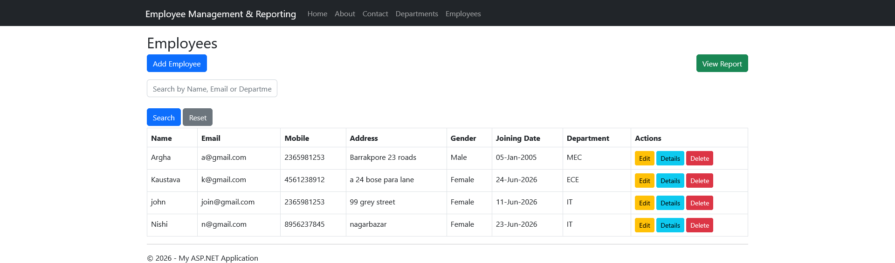
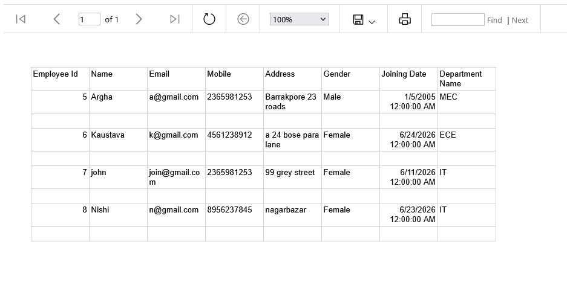

# Employee Management System with Dashboard & RDLC Reports

An ASP.NET MVC 5 web application developed using **C#**, **Entity Framework (Database First)**, and **SQL Server** for managing employees and departments. This enhanced version includes an interactive dashboard, employee search, responsive Bootstrap UI, and RDLC report generation.

---

## Features

### Employee Management
- Add Employee
- View Employee Details
- Update Employee Information
- Delete Employee

### Department Management
- Add Department
- View Department Details
- Update Department Information
- Delete Department

### Dashboard
- Total Employees
- Total Departments
- Male Employees Count
- Female Employees Count

### Search Functionality
- Search employees by name
- Instant employee filtering

### RDLC Reports
- Employee Report
- Department information included
- Print-friendly report
- Microsoft Report Viewer Integration

### Responsive UI
- Bootstrap-based modern interface
- Clean forms
- Responsive layout
- User-friendly navigation

---

# Technologies Used

- ASP.NET MVC 5
- C#
- Entity Framework (Database First)
- SQL Server
- Bootstrap
- HTML5
- CSS3
- JavaScript
- Razor View Engine
- RDLC Reports
- Microsoft Report Viewer

---

# Project Structure

```
EmployeeManagementSystem_Reports
│
├── Controllers
├── Models
├── Views
├── Reports
│     └── EmployeeReport.rdlc
├── Content
├── Scripts
├── assets
├── Web.config
└── EmployeeManagementSystem_Reports.sln
```

---

# Database Structure

## Employees

| Column |
|---------|
| EmployeeId |
| Name |
| Email |
| Mobile |
| Address |
| Gender |
| JoiningDate |
| DepartmentId |

---

## Departments

| Column |
|---------|
| DepartmentId |
| DepartmentName |
| ManagerName |

---

## Relationship

```
Department (1)
      │
      │
      ▼
Employees (Many)
```

---

# Application Screenshots

## Dashboard

<p align="center">

</p>

---

## Add Employee

<p align="center">

</p>

---

## Department List

<p align="center">

</p>

---

## Employee Search

<p align="center">

</p>

---

## RDLC Report

<p align="center">

</p>

---

# How to Run

## Clone Repository

```bash
git clone https://github.com/Arpit-tR/EmployeeManagementSystem_Reports.git
```

---

## Open Solution

Open in Visual Studio 2022

```
EmployeeManagementSystem_Reports.sln
```

---

## Restore NuGet Packages

```
Tools
→ NuGet Package Manager
→ Restore NuGet Packages
```

---

## Configure Database

Update the SQL Server connection string inside

```
Web.config
```

---

## Run

```
F5
```

or

```
Ctrl + F5
```

---

# Highlights

- ASP.NET MVC Architecture
- Entity Framework Database First
- SQL Server Integration
- Employee CRUD
- Department CRUD
- Dashboard Analytics
- Employee Search
- RDLC Report Generation
- Responsive Bootstrap UI
- Form Validation
- Clean Code Structure

---

# Future Improvements

- Crystal Reports Integration
- Export to PDF & Excel
- Login Authentication
- Role-Based Authorization
- Email Notifications
- Pagination
- REST API
- Charts & Analytics

---

# Related Project

## Employee Management System

A version of this project featuring:

- Employee CRUD
- Department CRUD
- PDF Report Generation

Repository:

https://github.com/Arpit-tR/EmployeeManagementSystem

---

# Author

**Arpit Sadhukhan**

GitHub

https://github.com/Arpit-tR

---

# License

This project was developed for learning, practice, and portfolio purposes.
